# food-delivery-RN
## 主要技术栈
- React-Native
- TailWindCSS
- Redux
- Sanity
- Grog

## client
> npm run web

## HomeScreen
实现Home屏幕内容
搜索栏 目前未实现搜索功能

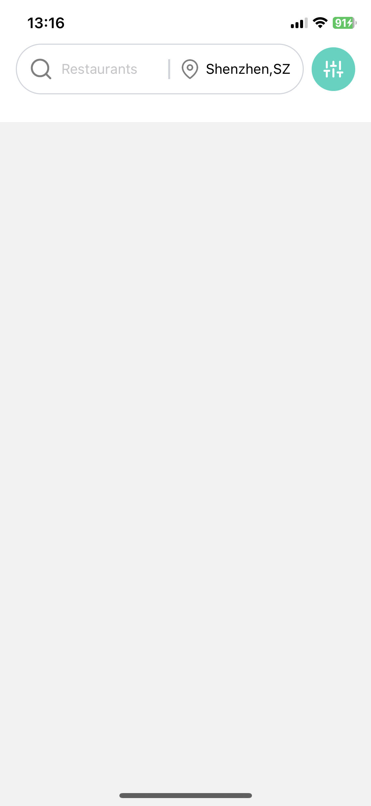
 
类别栏 目前未实现分类显示

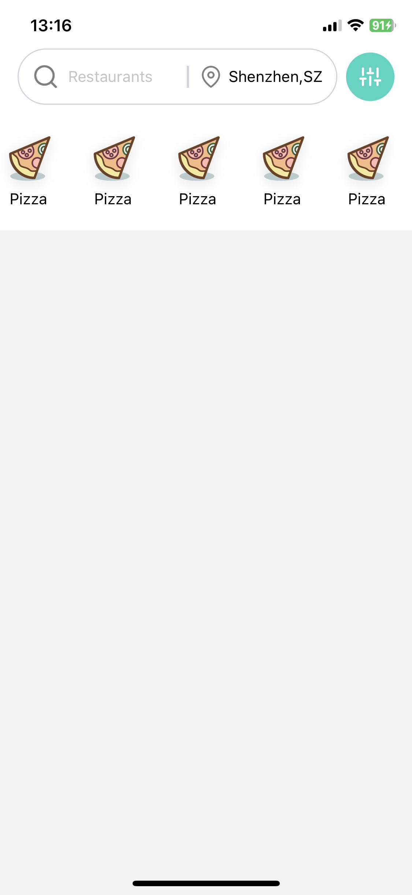
 
Home屏幕内容

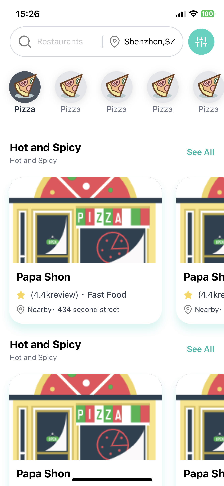
 
店铺内容

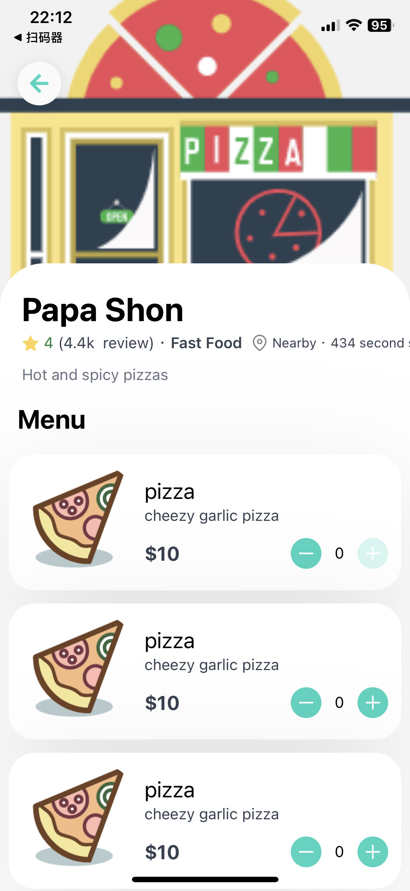
 
添加购物车

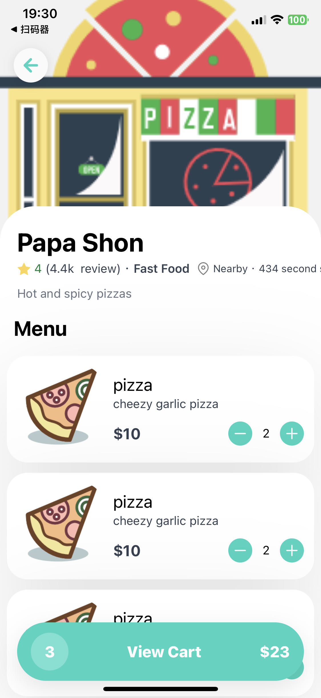
 
购物车卡片

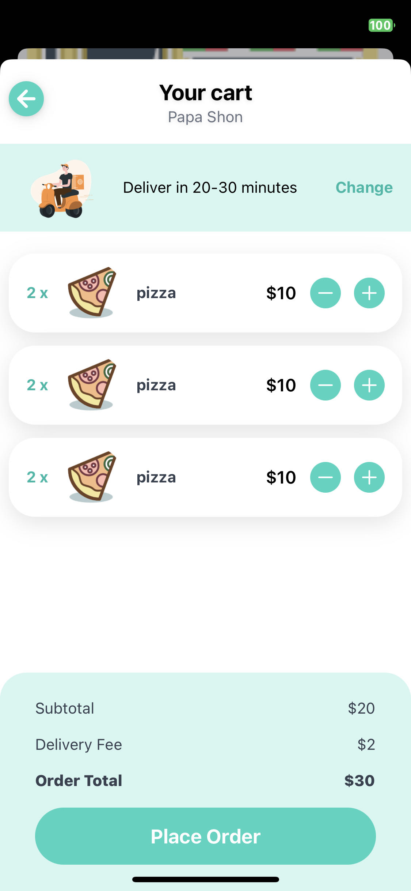
 

##deliveryScreen
实现delivery屏幕内容

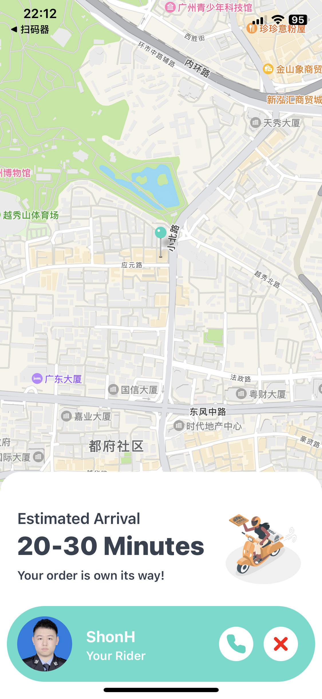
 
店铺位置显示信息

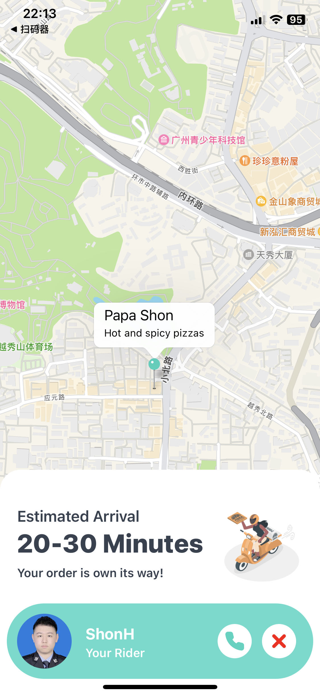
 
## redux
使用Redux进行点击操作
## sanity
使用后台sanity添加内容信息

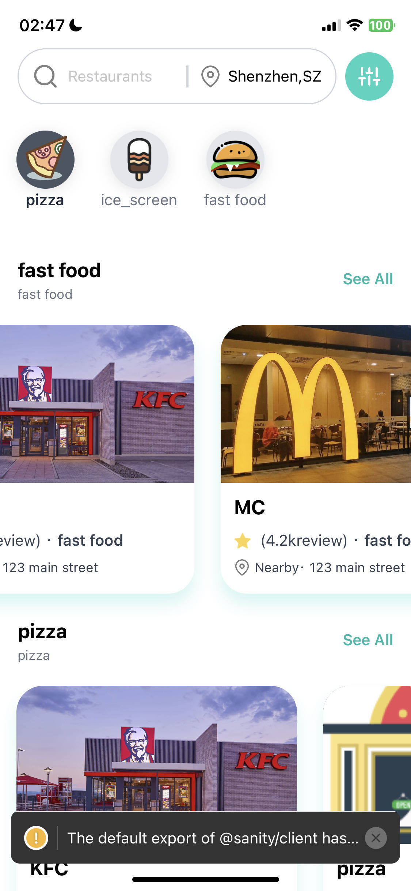
 

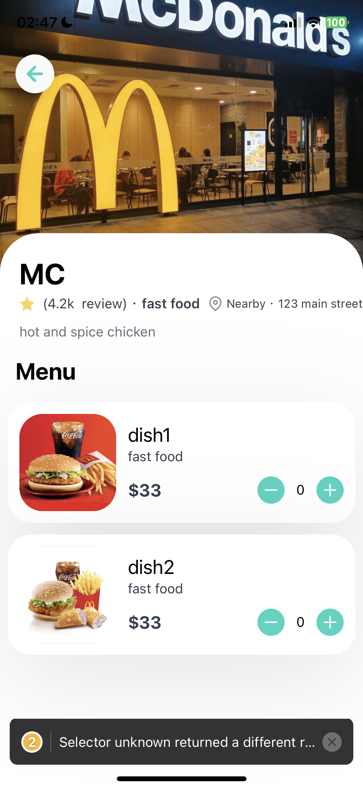
 

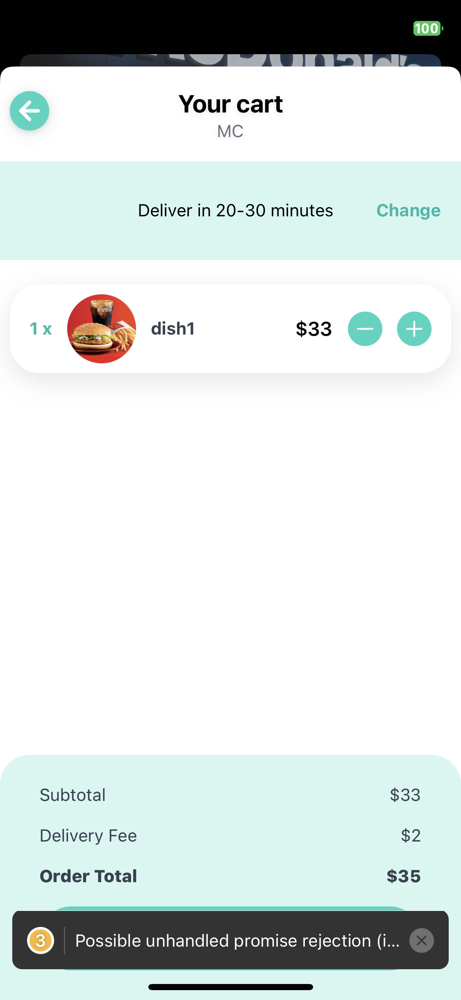
 
使用Grog查询数据内容

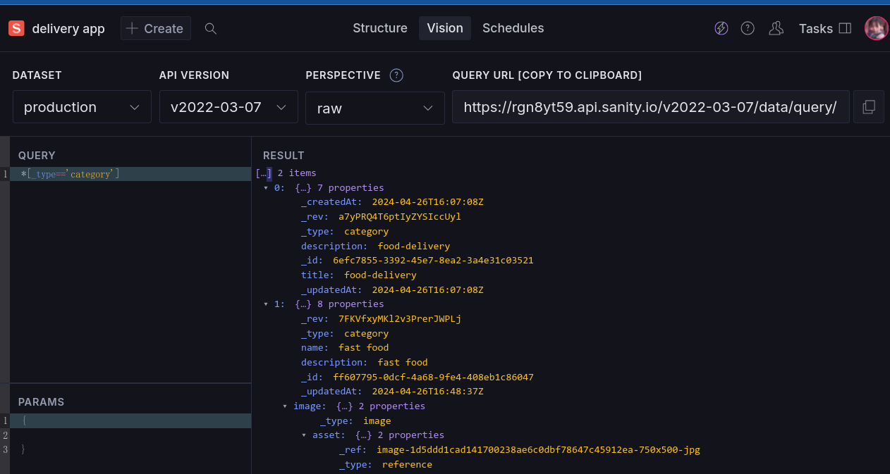
 
使用Sanity作为后端数据存储以及内容发布
使用Grog来查询获取sanity获取数据内容
运行

> npm run dev
部署
> npm run deploy

### need to fix
分类点击效果未完全实现
